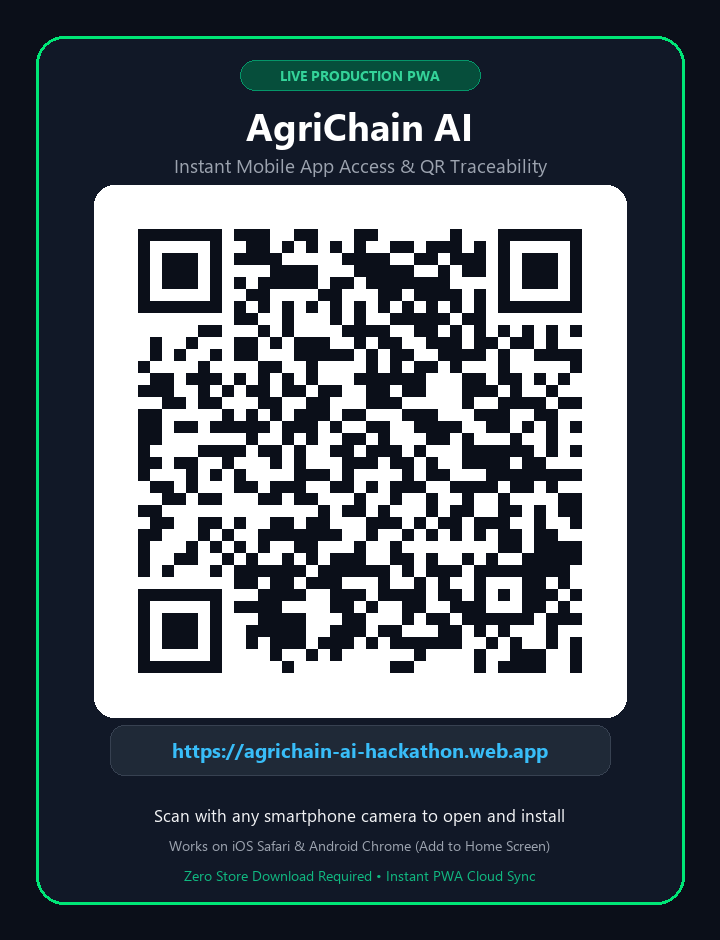

# 🌾 AgriChain AI

### AI-Powered Real-Time Agricultural Supply Chain Tracking, Risk Prediction & Logistics Optimization Platform
**Problem Statement AG-05 — Real-time agricultural supply chain tracking and logistics optimization**

---

## 📱 Instant Mobile App Access (Scan & Install)

Scan this QR code with any smartphone camera to instantly open and install **AgriChain AI** as a Progressive Web App (PWA) with zero store downloads required:

<div align="center">
  
  <p><b>Production Live URL:</b> <a href="https://agrichain-ai-hackathon.web.app">https://agrichain-ai-hackathon.web.app</a></p>
  <p><i>Compatible with iOS (Safari &rarr; Add to Home Screen) & Android (Chrome &rarr; Install App)</i></p>
</div>

---

## 🌟 1. Project Overview & Philosophy
**AgriChain AI** is an enterprise-grade agricultural logistics intelligence and farm-to-fork traceability platform built to protect perishable produce, eliminate cold-chain losses, and bring transparency to farmers, transporters, and consumers.

The platform executes around the core intelligence loop:
```text
DETECT ➔ PREDICT ➔ EXPLAIN ➔ OPTIMIZE ➔ ACT ➔ TRACE
```

---

## 🏗️ 2. Complete System Architecture

```text
       ┌─────────────────────────────────────────────────────────┐
       │                   ESP32 / SIMULATOR                     │
       │    (DHT22 Temp/Humidity + GPS Lat/Lng + Speed Telemetry) │
       └────────────┬─────────────────────────────┬──────────────┘
                    │ (HTTP POST Ingest)          │ (Direct Stream)
                    ▼                             ▼
       ┌────────────────────────┐      ┌─────────────────────────┐
       │  FastAPI IoT Endpoint  │      │  Firebase RTDB (Live)   │
       │   (/api/v1/iot/data)   ├─────►│  /live/shipments/{id}   │
       └────────────┬───────────┘      └────────────┬────────────┘
                    │                               │ (Live Sensor Stream)
                    ▼                               │
       ┌────────────────────────┐                   │
       │   FastAPI ML Engine    │                   │
       │  • Random Forest Spoil │                   │
       │  • GradientBoost Delay │                   │
       │  • Isolation Anomaly   │                   │
       │  • SHAP XAI Explainer  │                   │
       └────────────┬───────────┘                   │
                    │                               │
                    ▼ (Write Risk & Alerts)         ▼
       ┌────────────────────────┐      ┌─────────────────────────┐
       │    Cloud Firestore     │◄─────┤   Flutter Mobile App    │
       │  (Source of Truth)     │      │   • Riverpod + GoRouter │
       │  • Batches, Shipments  │      │   • RTDB Live Map       │
       │  • Traceability Events │      │   • QR Scanner/Gen      │
       │  • Alerts, Audit Logs  │      │   • SHAP XAI & Routes   │
       └────────────┬───────────┘      │   • Gemini AI Assistant │
                    │                  └────────────┬────────────┘
                    ▼ (Triggers)                    │ (ML & AI Requests)
       ┌────────────────────────┐                   │
       │ Firebase Cloud Funcs   │                   │
       │ & FCM Notifications    │◄──────────────────┘
       └────────────────────────┘
```

---

## 🔥 3. Firebase Architecture & Dual-Database Strategy

### Cloud Firestore (Primary Business Source of Truth)
- `users/{userId}`: Profiles with role-based attributes (`farmer`, `transporter`, `warehouse_manager`, `buyer`, `admin`).
- `crop_batches/{batchId}`: Agricultural cargo specifications, harvest date, safe temperature/humidity ranges, quality grades.
- `shipments/{shipmentId}`: Logistics dispatch, assigned transporter, vehicle registration, and destination hub.
- `batch_events/{eventId}`: Immutable farm-to-fork audit log powering public QR verification.
- `risk_predictions/{predictionId}`: ML risk outputs and prescriptive action prescriptions.
- `route_recommendations/{recommendationId}`: Multi-objective candidate routes.
- `alerts/{alertId}`, `notifications/{id}`, `audit_logs/{id}`, `analytics/{id}`.

### Firebase Realtime Database (High-Frequency Live Telemetry)
Stores high-frequency sensor streams (1–5 second intervals) under:
- `live/shipments/{shipmentId}`: Latitude, longitude, temperature, humidity, speed, battery, device health status.
- `live/devices/{deviceId}`: Heartbeat ping, firmware version, and connection status.

---

## 🤖 4. Machine Learning & Explainable AI (XAI)
- **Spoilage Prediction Model**: Scikit-Learn Random Forest Regressor ($R^2 = 0.9903$, MAE: $2.23\%$) predicting cumulative degree-hours and moisture degradation.
- **Delay Prediction Model**: Gradient Boosting Regressor ($R^2 = 0.9999$) predicting logistics arrival deviations in minutes.
- **Anomaly Detection Model**: Isolation Forest identifying sensor tampering, hardware faults, or thermal breaches.
- **Explainable AI (SHAP / Attribution)**: Evaluates exact percentage impact of each feature (e.g. Temperature Excursion $+42.5\%$, Route Delay $+28.0\%$).
- **Google Gemini Context-Aware Assistant**: Grounded in live batch telemetry to answer questions such as *"Why is this shipment risky?"* and *"What should the transporter do?"*.

---

## 📱 5. Flutter Mobile Application
- **Architecture**: Clean Feature-First pattern with Riverpod state management and GoRouter.
- **Multi-Persona Access**: Instant switching between Farmer, Transporter, Warehouse, Buyer, and Admin modes.
- **Live Stream Tracking**: Subscribes directly to Firebase RTDB for 60fps real-time map tracking without high Firestore billing.
- **Traceability Engine**: Generates QR tags (`qr_flutter`) and presents interactive step-by-step audit timelines.
- **Route Optimizer**: Pareto scoring balancing ETA, Toll/Fuel Cost, and Spoilage Risk across alternate highway corridors.

---

## 📡 6. ESP32 Hardware & Simulation Suite
- **Hardware Firmware (`iot/esp32/agrichain_node.ino`)**: C++ code reading DHT22 (temp + humidity) and NEO-6M GPS, transmitting authenticated JSON telemetry over HTTP.
- **Hackathon Simulation Engine**: Interactive simulator (`simulation/run_simulation.py` and mobile UI) with real-time anomaly injection:
  - Temperature Spike ($32.8^\circ\text{C}$ Reefer Failure)
  - Traffic Delay ($+75$ min Kasara Ghat Blockade)
  - Humidity Spike ($94\%$ Mold Hazard)
  - IoT Battery Cutoff ($6\%$ Alert)
  - Reset to Optimal ($20.2^\circ\text{C}, 67\%$)

---

## 🚀 7. Running the Platform Locally

### Prerequisites
- Python 3.10+ (via `py` or `python`)
- Flutter 3.20+
- Node.js 18+

### 1. Start the FastAPI Intelligence Backend
```bash
cd backend
pip install -r requirements.txt
python -m app.ml.trainer   # Train & save ML models
uvicorn app.main:app --host 0.0.0.0 --port 8000 --reload
```
Interactive OpenAPI Swagger documentation available at: `http://127.0.0.1:8000/docs`.

### 2. Run the Python Unit Tests
```bash
cd backend
pytest tests
```

### 3. Launch the Flutter Mobile App
```bash
cd mobile
flutter run -d chrome      # Or target: windows, android, ios
```

### 4. Run via Docker Compose
```bash
docker compose up --build
```

---

## 🎬 8. 14-Step Hackathon Live Demonstration Scenario

1. **Farmer Persona**: Log in and create a new Tomato harvest batch (`1,200 kg`, Grade A).
2. **QR Generation**: View the auto-generated QR tag.
3. **Dispatch Shipment**: Assign to Reefer Truck `MH-15-EG-8842`.
4. **Live Normal Stream**: Open Live Tracking; see temperature at $20.2^\circ\text{C}$ (Green).
5. **Inject Temperature Anomaly**: Tap *"Trigger Temperature Spike"* in Demo Mode.
6. **Telemetry Breach**: Live gauge climbs to $32.8^\circ\text{C}$; red badge triggers.
7. **ML Spoilage Model**: Spoilage risk jumps to $82\%$ within seconds.
8. **Explainable AI (SHAP)**: Inspect feature attribution bar chart showing Temperature Excursion as $42.5\%$ driver.
9. **Inject Route Traffic Delay**: Add $+75$ minutes of delay.
10. **Composite Risk Escalation**: Overall risk escalates to CRITICAL ($82/100$).
11. **Route Optimizer**: Run multi-objective optimizer; Corridor A (Samruddhi Expressway) recommended.
12. **Ask Gemini Assistant**: Ask *"What should the transporter do?"* and review prescribed instructions.
13. **Public QR Trace**: Scan batch QR tag from consumer/buyer perspective.
14. **Immutable Timeline**: Review harvest, collection, and transport checkpoints with cryptographic verification.
